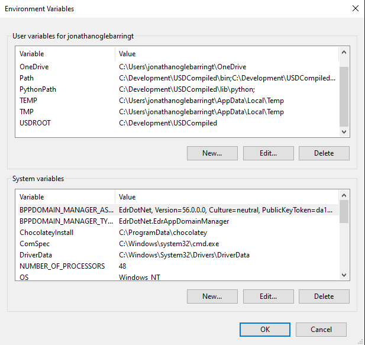

# USDProject

## USD Installation

* Remove all other versions of Python. Also clean up any installations of USD or any of the pre-requisits 

* Download and install Python from this address. Be sure to go for a customised approach and tick the check box for Add Python to environment variable
https://www.python.org/ftp/python/3.7.9/python-3.7.9-amd64.exe

* Next we are going to clone the source of USD from Github and use the release channel 
https://github.com/PixarAnimationStudios/USD.git

* Clone it to a directory anywhere on your computer, I always use C:\Development\ 

* Next we need to setup some environment variables

* Press the windows key and start typing "Edit the system environment variables" and select the top option. It will bring up a dialog called "System Properties"

* At the bottom click "Environment Variables" then click "New..." under User variables, not system variables

* Add the following

    * Variable name : "USDROOT"
    * Variable value : "C:\USD"

    * Variable name : "PythonPath"
    * Variable value : "%USDROOT%\lib\python;"

* We then need to add the following to the front of the "Path" variable

    * %USDROOT%\bin;
    * %USDROOT%\lib;

* When this is all done it should look like the following

&nbsp;&nbsp;&nbsp;&nbsp;&nbsp;&nbsp;

* Now open a command prompt and issue the following commands

  * python -m pip install --upgrade pip

  * pip install PySide2

  * pip install PyOpenGL

* Finally we are going to build the source using an easy python command, replace "C:\Development\USD\build_scripts" with a link to the USD folder you clone or downloaded from Git earlier

* python C:\Development\USD\build_scripts\build_usd.py "C:\USD"

* Thats it. We have everything read and you should be able to test the install by issuing one of the commands below

* usdcat.cmd %USDROOT%\share\usd\tutorials\convertingLayerFormats\Sphere.usd

* usdview.cmd %USDROOT%\share\usd\tutorials\traversingStage\HelloWorld.usda
