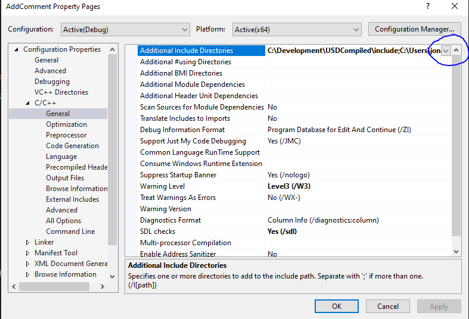

# USDProject

## Adding a comment

In the first task we are going to look at adding a comment to meta data and saving out a USD file from a commandline C++ application

* Start by opening VS 2022/2019, filter language by C++ and select "Console App"

* Name your project "AddComment", save you project to a directory of your choice and name the Solution "USDProject

* If you run the project you will see a command prompt open and it will print out the sentence "Hello World!" which is great but not at all related to USD

* To get started working with USD we will need to tell Visual studio about USD and where some of the files exist. Firstly we need to point VS at some include files that tell VS what functions are available in the libraries we are going to link to

  * Start by right clicking on the project name and selecting properties
  * Then expand the "C/C++" configuration tree and select "General" and click the arrow on "Additional Includes Directories" and click "Edit"  
  
  * Select an empty row and add a reference to the includes directory within the compiled USD directory. If you followed the readme and installed to the same directories it will be "C:\Development\USDCompiled\include"
  * Next we need to point a reference to the include directory for our Python installation. Again if you installed the same version of python as detailed in the readme document and didnt changes the installation path it will be something similar to "C:\Users\jonathanoglebarringt\AppData\Local\Programs\Python\Python37\include" except with your username not mine
  * Finally we are going to tell visual studio where it can find the include files for boost, again they should be in a folder similar to this, you may have boost-1_71 depending on when you installed USD "C:\Development\USDCompiled\include\boost-1_70"
  * With those added click the "Ok" button

* Now we need to point VS to the acutal library files. If you are interested in knowing the difference between a lib and dll take a look at this [link](http://www.differencebetween.net/technology/difference-between-lib-and-dll/#:~:text=LIB%20vs%20DLL&text=LIB%20is%20a%20static%20library,and%20not%20during%20the%20compilation) 

  * In the same propert window as above expand the "Linker" section and select "Input" and click on the arrow for "Additional Dependencies" and click "Edit
  * We now need to reference the library (lib) files we intend to use in our application. If you find that you do not have "boost_python37-vc142-mt-gd-x64-1_70.lib" you will probably have "boost_python37-vc142-mt-x64-1_70.lib", just make a copy and add the missing "-gd" to the filename.
  
    * C:\Development\USDCompiled\lib\boost_python37-vc142-mt-gd-x64-1_70.lib
    * C:\Users\jonathanoglebarringt\AppData\Local\Programs\Python\Python37\libs\python37.lib
    * C:\Development\USDCompiled\lib\usd_usd.lib
    * C:\Development\USDCompiled\lib\usd_usdGeom.lib
    * C:\Development\USDCompiled\lib\tbb_debug.lib
    * C:\Development\USDCompiled\lib\usd_sdf.lib
    * C:\Development\USDCompiled\lib\usd_vt.lib

  * To make this a bit more interesting rather than following my intrusctions blindy I have forgotten to add in one of the libraries you will require to compile the finished application. Using the output window and error logs see if you can work out which library is required out of the following

    * C:\Development\USDCompiled\lib\usd_hd.lib
    * C:\Development\USDCompiled\lib\usd_arch.lib
    * C:\Development\USDCompiled\lib\usd_hdx.lib
    * C:\Development\USDCompiled\lib\usd_kind.lib
    * C:\Development\USDCompiled\lib\usd_ndir.lib
    * C:\Development\USDCompiled\lib\usd_pcp.lib
    * C:\Development\USDCompiled\lib\usd_tf.lib
    * C:\Development\USDCompiled\lib\usd_gf.lib